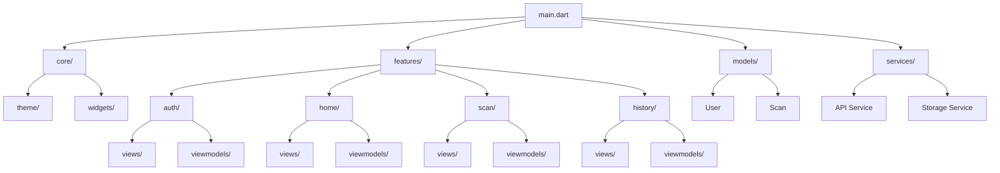
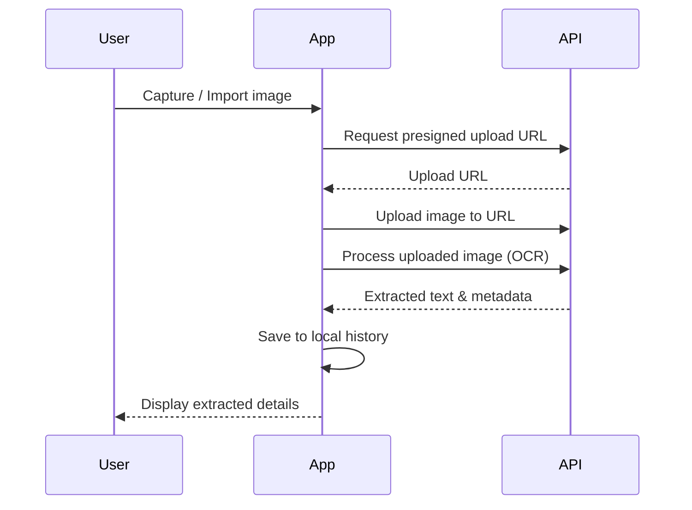

# IntelliPost

> Smart document scanner for India Post letters — digitize, extract, and organize postal correspondence with ease.


## Features

- **Document Scanning** — Capture letters using your device camera with auto-edge detection
- **Gallery Import** — Import existing images from your photo library
- **Text Extraction** — AI-powered OCR to extract sender/recipient details, addresses, and pincodes
- **Scan History** — Browse and search through all your digitized letters
- **Dark Theme** — Beautiful dark UI designed for comfortable viewing

## Screenshots

| Login | Home | Scan | History |
|:-----:|:----:|:----:|:-------:|
|  |  |  |  |

## Architecture

The app follows **MVVM** with Provider for state management.



### Scan Flow



## Getting Started

### Prerequisites

- Flutter SDK 3.10+
- Dart 3.0+
- Android Studio / VS Code
- Android emulator or physical device

### Installation

```bash
git clone https://github.com/yourusername/intellipost.git
cd intellipost/app
flutter pub get
flutter run
```

## Tech Stack

| Category | Technology |
|----------|------------|
| Framework | Flutter |
| Language | Dart |
| State Management | Provider |
| Local Storage | Hive |
| Camera | camera, image\_picker |
| HTTP Client | http |

## Configuration

### Android Permissions

Camera and storage permissions are configured in `android/app/src/main/AndroidManifest.xml`:

```xml
<uses-permission android:name="android.permission.CAMERA" />
<uses-permission android:name="android.permission.READ_MEDIA_IMAGES" />
```

## License

This project is licensed under the MIT License — see the [LICENSE](LICENSE) file for details.

## Contributing

Contributions are welcome! Please feel free to submit a Pull Request.

1. Fork the project
2. Create your feature branch (`git checkout -b feature/amazing-feature`)
3. Commit your changes
4. Push to the branch
5. Open a Pull Request
