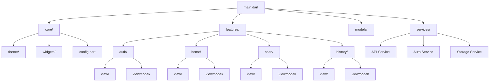
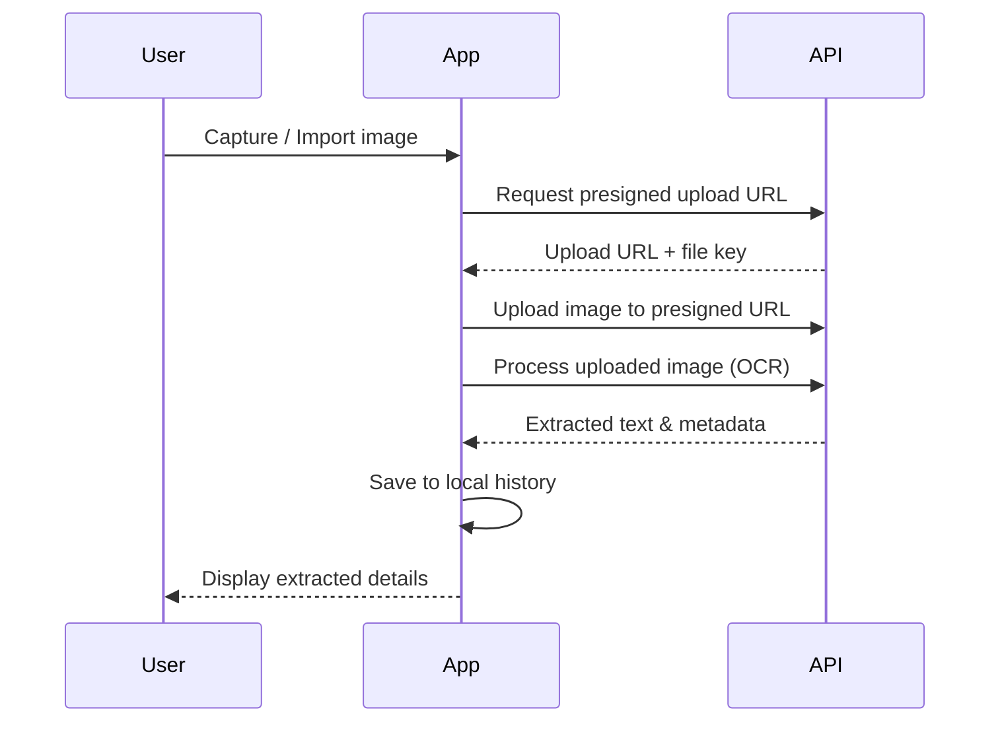

# IntelliPost

> Smart document scanner for India Post letters — digitize, extract, and organize postal correspondence with ease.


## Features

- **Document Scanning** — Capture letters using your device camera
- **Gallery Import** — Import existing images from your photo library
- **Text Extraction** — AI-powered OCR to extract sender/recipient details, addresses, and pincodes
- **Scan History** — Browse, filter, and sort through all your digitized letters
- **Dark Theme** — Polished dark UI designed for comfortable viewing

## Architecture

The app follows **MVVM** with Provider for state management.



### Scan Flow



## Getting Started

### Prerequisites

- Flutter SDK 3.10+
- Dart 3.0+
- Android Studio / VS Code
- Android emulator or physical device

### Setup

```bash
git clone https://github.com/yourusername/intellipost.git
cd intellipost
flutter pub get
flutter run
```

### Configuration

The API base URL is configured in `lib/core/config.dart`:

```dart
class AppConfig {
  static const String apiBaseUrl = 'http://44.222.223.134';
}
```

Update this to point to your backend instance.

### Android Permissions

Camera and storage permissions are configured in `android/app/src/main/AndroidManifest.xml`:

```xml
<uses-permission android:name="android.permission.CAMERA" />
<uses-permission android:name="android.permission.READ_MEDIA_IMAGES" />
```

## Tech Stack

| Category | Technology |
|----------|------------|
| Framework | Flutter |
| Language | Dart |
| State Management | Provider (MVVM) |
| Local Storage | Hive |
| Camera | camera, image\_picker |
| HTTP Client | http |

## Project Structure

```
lib/
├── core/
│   ├── config.dart          # API and app configuration
│   ├── theme/               # Colors, text styles, theme data
│   └── widgets/             # Shared UI components
├── features/
│   ├── auth/                # Login & registration
│   ├── home/                # Home screen & navigation
│   ├── scan/                # Camera, preview, scan options
│   └── history/             # Scan history & detail views
├── models/                  # UserModel, ScanModel (Hive)
├── services/                # API, Auth, and Storage services
└── main.dart                # App entry point & routing
```

## License

This project is licensed under the MIT License — see the [LICENSE](LICENSE) file for details.
