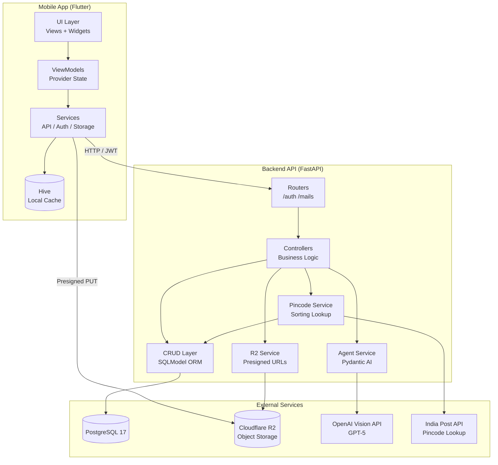
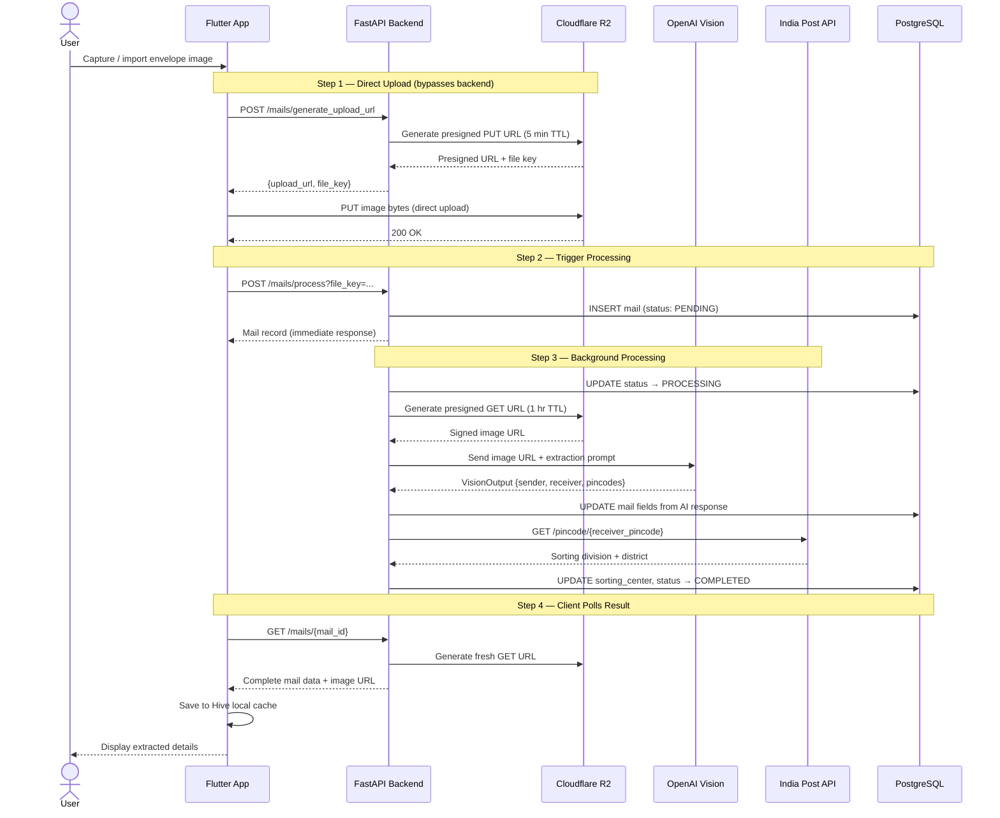
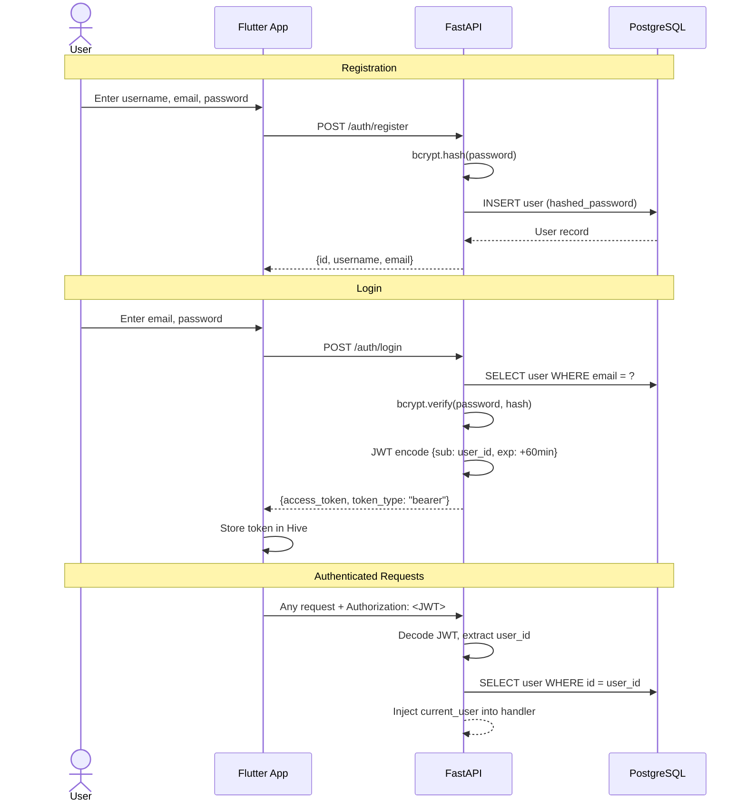
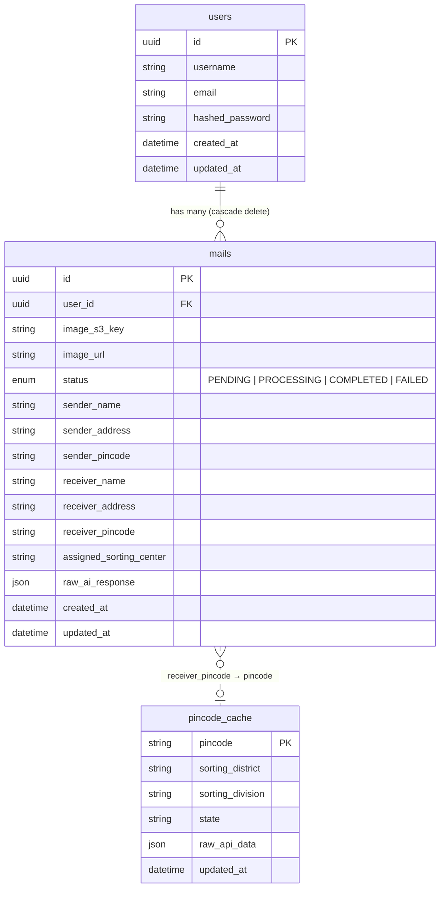
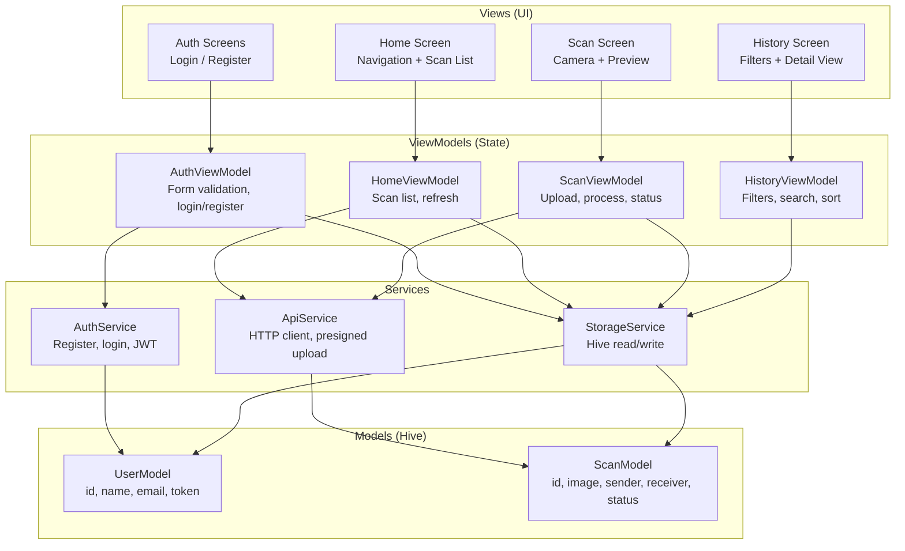

# IntelliPost

> AI-powered postal mail scanner for India Post — capture envelope images, extract sender/recipient details via vision AI, and auto-assign sorting centers using pincode lookup.


## Features

- **Envelope Scanning** — Capture postal envelopes via camera or import from gallery
- **AI-Powered Extraction** — Vision model reads handwritten/printed addresses, names, and pincodes from envelope images
- **Sorting Center Assignment** — Automatically resolves receiver pincode to the correct India Post sorting division
- **Presigned Uploads** — Images upload directly to Cloudflare R2 via presigned URLs (zero backend bandwidth)
- **Scan History** — Browse, filter, and review all processed mail with full extracted details
- **JWT Authentication** — Secure user registration and login with bcrypt password hashing

## System Architecture



## API Endpoints

| Method | Endpoint | Auth | Description |
|--------|----------|------|-------------|
| `POST` | `/api/v1/auth/register` | No | Create account with username, email, password |
| `POST` | `/api/v1/auth/login` | No | Authenticate and receive JWT access token |
| `POST` | `/api/v1/mails/generate_upload_url` | JWT | Get presigned R2 PUT URL + file key |
| `POST` | `/api/v1/mails/process?file_key=...` | JWT | Trigger background AI processing on uploaded image |
| `GET`  | `/api/v1/mails/?limit=20&offset=0` | JWT | List user's processed mail (paginated) |
| `GET`  | `/api/v1/mails/{mail_id}` | JWT | Get single mail with fresh presigned image URL |

## Mail Processing Pipeline

The core workflow from image capture to sorted mail result:



## Authentication Flow



## Database Schema



## Mobile App Architecture

The Flutter app follows **MVVM** with Provider for state management:



## Getting Started

### Prerequisites

- Flutter SDK 3.10+
- Python 3.13+ with [uv](https://docs.astral.sh/uv/)
- Docker & Docker Compose
- An OpenAI API key (for vision model)
- A Cloudflare R2 bucket (for image storage)

### Backend Setup

1. **Start PostgreSQL:**
   ```bash
   docker compose up -d
   ```

2. **Configure environment** — create a `.env` in the project root:
   ```env
   PROJECT_NAME=IntelliPost
   SECRET_KEY=your-secret-key

   DATABASE_USER=postgres
   DATABASE_PASSWORD=postgres
   DATABASE_HOST=localhost
   DATABASE_PORT=5432
   DATABASE_NAME=intellipost

   R2_ACCOUNT_ID=your-cloudflare-account-id
   R2_ACCESS_KEY_ID=your-r2-access-key
   R2_SECRET_ACCESS_KEY=your-r2-secret-key
   R2_BUCKET_NAME=your-bucket-name

   OPENAI_API_KEY=your-openai-api-key
   VISION_MODEL_NAME=gpt-4o
   ```

3. **Install dependencies and run migrations:**
   ```bash
   uv sync
   uv run alembic upgrade head
   ```

4. **Start the API server:**
   ```bash
   uv run uvicorn backend.app.main:app --reload --port 8000
   ```

### Mobile App Setup

1. **Update the API URL** in `lib/core/config.dart` to point to your backend:
   ```dart
   class AppConfig {
     static const String apiBaseUrl = 'http://localhost:8000';
   }
   ```

2. **Run the app:**
   ```bash
   flutter pub get
   flutter run
   ```

### Docker Deployment

```bash
docker build -t intellipost .
docker compose up -d
docker run -p 8000:8000 --env-file .env intellipost
```

## Tech Stack

| Layer | Technology | Purpose |
|-------|-----------|---------|
| Mobile | Flutter / Dart | Cross-platform UI |
| State | Provider (MVVM) | Reactive state management |
| Local DB | Hive | Offline scan cache |
| Camera | camera, image_picker | Image capture and import |
| Backend | FastAPI / Python 3.13 | REST API server |
| ORM | SQLModel | Async PostgreSQL ORM |
| Database | PostgreSQL 17 | Persistent storage |
| Migrations | Alembic | Schema versioning |
| Auth | JWT (HS256) + bcrypt | Stateless authentication |
| AI | Pydantic AI + OpenAI Vision | Structured envelope OCR |
| Storage | Cloudflare R2 (S3) | Image object storage |
| Deploy | Docker (multi-stage) | Production containerization |

## Project Structure

```
intellipost/
├── lib/                                # Flutter mobile app
│   ├── main.dart                       # Entry point, routing, providers
│   ├── core/
│   │   ├── config.dart                 # API base URL, timeouts
│   │   ├── theme/                      # Colors, text styles, ThemeData
│   │   └── widgets/                    # Shared UI components
│   ├── features/
│   │   ├── auth/
│   │   │   ├── view/                   # Login & register screens
│   │   │   └── viewmodel/              # Form validation, auth state
│   │   ├── home/
│   │   │   ├── view/                   # Home screen, scan list
│   │   │   └── viewmodel/              # Scan fetching, refresh
│   │   ├── scan/
│   │   │   ├── view/                   # Camera, preview, options sheet
│   │   │   └── viewmodel/              # Upload + process workflow
│   │   └── history/
│   │       ├── view/                   # History list, detail view
│   │       └── viewmodel/              # Filtering, sorting
│   ├── models/
│   │   ├── scan_model.dart             # ScanModel (Hive TypeAdapter)
│   │   └── user_model.dart             # UserModel (Hive TypeAdapter)
│   └── services/
│       ├── api_service.dart            # HTTP client, presigned upload, mail CRUD
│       ├── auth_service.dart           # Register, login, JWT storage
│       └── storage_service.dart        # Hive wrapper for local persistence
│
├── backend/                            # FastAPI backend
│   ├── app/
│   │   ├── main.py                     # FastAPI app, CORS, router mount
│   │   ├── api/
│   │   │   ├── deps.py                 # get_db session, get_current_user JWT dep
│   │   │   └── v1/
│   │   │       ├── api.py              # Router aggregator (/auth + /mails)
│   │   │       └── routers/
│   │   │           ├── auth.py         # POST /register, POST /login
│   │   │           └── mail.py         # Upload URL, process, list, get
│   │   ├── controllers/
│   │   │   ├── mail.py                 # Mail lifecycle: init → process → query
│   │   │   └── r2.py                   # File key generation + upload URL
│   │   ├── core/
│   │   │   ├── config.py              # Pydantic Settings, env vars, AI model init
│   │   │   ├── jwt.py                 # HS256 token create / decode
│   │   │   └── security.py            # bcrypt hash / verify
│   │   ├── crud/
│   │   │   ├── base_crud.py           # Generic async CRUD (get, create, update, remove)
│   │   │   └── user_crud.py           # User-specific: get_by_email, hashed create
│   │   ├── db/
│   │   │   └── database.py            # AsyncSession factory, connection pool
│   │   ├── models/
│   │   │   ├── base_model.py          # BaseUUIDModel (id, created_at, updated_at)
│   │   │   ├── user_model.py          # User table
│   │   │   ├── mail_model.py          # Mail table (status enum, AI fields)
│   │   │   ├── pincode_cache_model.py # Pincode → sorting center cache
│   │   │   └── enums/enums.py         # ProcessingStatus enum
│   │   ├── schemas/
│   │   │   ├── user_schema.py         # UserCreate, UserRead, UserLogin
│   │   │   └── agent_output_schema.py # VisionOutput (structured AI response)
│   │   ├── services/
│   │   │   ├── agent_service.py       # Pydantic AI agent wrapper
│   │   │   ├── r2_service.py          # boto3 S3 client for Cloudflare R2
│   │   │   └── pincode_lookup_service.py  # India Post API + DB cache
│   │   ├── prompts/
│   │   │   └── prompt.md              # Vision model system prompt
│   │   └── utils/
│   │       ├── agent.py               # Secondary AI agents (summary, sentiment)
│   │       ├── pdf_extractor.py       # PyPDF2 text extraction
│   │       └── report_generator.py    # Jinja2 + WeasyPrint PDF reports
│   ├── alembic/
│   │   ├── env.py                     # Async migration runner (SSL for NeonDB)
│   │   └── versions/                  # Migration scripts
│   └── alembic.ini                    # Alembic configuration
│
├── test/                               # Flutter unit tests
│   ├── models/
│   │   ├── scan_model_test.dart
│   │   └── user_model_test.dart
│   └── services/
│       ├── api_response_test.dart
│       └── auth_validation_test.dart
│
├── Dockerfile                          # Multi-stage Python build
├── docker-compose.yml                  # PostgreSQL 17 service
├── pyproject.toml                      # Python dependencies (uv)
├── pubspec.yaml                        # Flutter dependencies
└── .env                                # Environment variables (not committed)
```

## License

This project is licensed under the MIT License.
