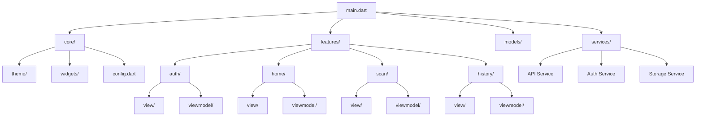
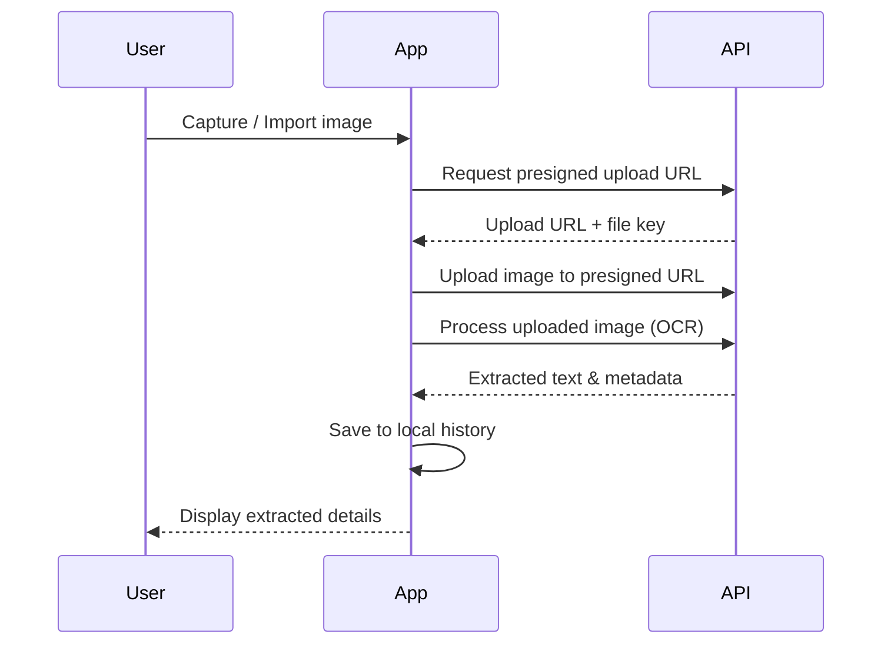

# IntelliPost

> Smart document scanner for India Post letters — digitize, extract, and organize postal correspondence with AI-powered OCR.


## Features

- **Document Scanning** — Capture letters using your device camera
- **Gallery Import** — Import existing images from your photo library
- **Text Extraction** — AI-powered OCR to extract sender/recipient details, addresses, and pincodes
- **Scan History** — Browse, filter, and sort through all your digitized letters
- **Dark Theme** — Polished dark UI designed for comfortable viewing

## Architecture

The app follows **MVVM** with Provider for state management.



### Scan Flow



## Getting Started

### Prerequisites

- Flutter SDK 3.10+
- Dart 3.0+
- Python 3.13+ with [uv](https://docs.astral.sh/uv/)
- Docker & Docker Compose
- Android Studio / VS Code

### Backend Setup

```bash
# Start PostgreSQL
docker compose up -d

# Install Python dependencies
uv sync

# Run database migrations
uv run alembic upgrade head

# Start the API server
uv run uvicorn backend.app.main:app --reload
```

The backend requires a `.env` file in the project root with your database URL, S3 credentials, and AI API keys. See `backend/app/core/config.py` for all required environment variables.

### Mobile App Setup

```bash
flutter pub get
flutter run
```

### Configuration

The API base URL is configured in `lib/core/config.dart`:

```dart
class AppConfig {
  static const String apiBaseUrl = 'http://44.222.223.134';
}
```

Update this to point to your backend instance.

### Docker Deployment

```bash
# Build and run the full stack
docker build -t intellipost .
docker compose up -d
docker run -p 8000:8000 --env-file .env intellipost
```

### Android Permissions

Camera and storage permissions are configured in `android/app/src/main/AndroidManifest.xml`:

```xml
<uses-permission android:name="android.permission.CAMERA" />
<uses-permission android:name="android.permission.READ_MEDIA_IMAGES" />
```

## Tech Stack

| Category | Technology |
|----------|------------|
| Mobile Framework | Flutter / Dart |
| State Management | Provider (MVVM) |
| Local Storage | Hive |
| Camera | camera, image\_picker |
| Backend Framework | FastAPI / Python |
| Database | PostgreSQL 17 |
| Migrations | Alembic |
| AI Processing | Pydantic AI |
| Object Storage | Cloudflare R2 (S3-compatible) |
| Containerization | Docker |

## Project Structure

```
├── lib/                         # Flutter mobile app
│   ├── core/
│   │   ├── config.dart          # API and app configuration
│   │   ├── theme/               # Colors, text styles, theme data
│   │   └── widgets/             # Shared UI components
│   ├── features/
│   │   ├── auth/                # Login & registration
│   │   ├── home/                # Home screen & navigation
│   │   ├── scan/                # Camera, preview, scan options
│   │   └── history/             # Scan history & detail views
│   ├── models/                  # UserModel, ScanModel (Hive)
│   ├── services/                # API, Auth, and Storage services
│   └── main.dart                # App entry point & routing
│
├── backend/                     # FastAPI backend
│   ├── app/
│   │   ├── api/                 # Route handlers
│   │   ├── controllers/         # Business logic
│   │   ├── core/                # Config, security, dependencies
│   │   ├── crud/                # Database operations
│   │   ├── db/                  # Database connection & session
│   │   ├── models/              # SQLModel ORM models
│   │   ├── schemas/             # Pydantic request/response schemas
│   │   ├── services/            # S3, AI processing services
│   │   ├── prompts/             # AI prompt templates
│   │   └── utils/               # Helper utilities
│   ├── alembic/                 # Database migration scripts
│   └── alembic.ini              # Alembic configuration
│
├── Dockerfile                   # Multi-stage production build
├── docker-compose.yml           # PostgreSQL service
└── pyproject.toml               # Python dependencies
```

## License

This project is licensed under the MIT License — see the [LICENSE](LICENSE) file for details.
